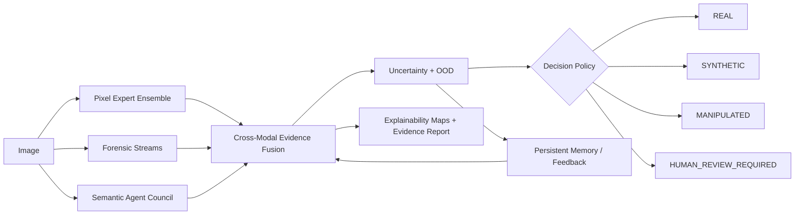

# MMAIFA Next-Generation Forensic Reasoning Architecture

This implementation preserves the patented MMAIFA streams while changing the
operating model from classifier-centric to evidence-centric.

## Core Streams

- Pixel stream: legacy EfficientNet/AlexNet/GoogLeNet compatibility plus
  ConvNeXt-V2, Swin V2, DINOv2, CLIP ViT-L/14, SigLIP, frequency-aware ViT,
  cross-scale transformer, patch-forensic encoder, and generator specialists.
- Forensic stream: ELA/FFT/noise/compression compatibility plus PRNU, SRM,
  Bayar-like residuals, DnCNN-like residual probes, diffusion traces, advanced
  frequency pyramids, CFA, lens, rolling-shutter, EXIF, and aberration probes.
- Semantic stream: CLIP-style prompt reasoning plus independent agents for
  anatomy, typography, lighting, reflection, perspective, object relations,
  human realism, contextual logic, scene geometry, and physics.
- Fusion: dynamic stream reliability, evidence weighting, disagreement
  collapse, and open-set uncertainty before the review policy.

## Decision Labels

The API supports `REAL`, `AI_GENERATED`, `MANIPULATED`,
`UNKNOWN`, and `HUMAN_REVIEW_REQUIRED`. High disagreement, high OOD, or narrow
margins reduce confidence and route cases to review.

## Heavy Model Deployment

Local inference remains deterministic and lightweight. Production deployments
can attach ONNX/TensorRT/Triton artifacts through `inference/model_registry.py`
without changing API contracts.

## API Surface

- `POST /predict`
- `POST /predict/batch`
- `POST /explain`
- `POST /heatmap`
- `POST /evidence`
- `POST /uncertainty`
- `POST /ood`
- `GET /review`
- `POST /review`
- `GET /review/queue`
- `POST /feedback`
- `WS /ws/progress`
